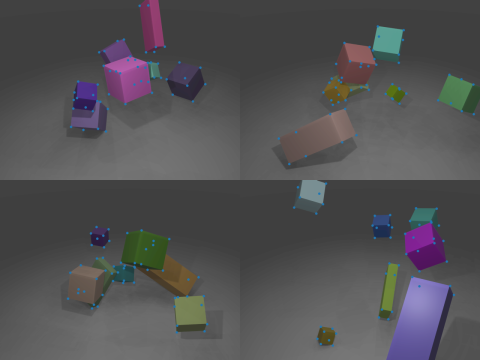

# blendtorch

**blendtorch** is a Python framework to seamlessly integrate [Blender](http://blender.orf) renderings into [PyTorch](http://pytorch.org) datasets for deep learning from artificial visual data. We utilize Eevee, a new physically based real-time renderer, to synthesize images and annotations at 60FPS and thus avoid stalling model training in many cases.

Feature summary
- Blender Eevee support for real-time rendering.
- Seamless streaming into PyTorch data pipelines.
- Supports arbitrary pickle-able objects to be send alongside images/videos.
- Builtin recording capability to replay data without Blender.

## Minimal sample
Running [demo.py](./demo.py) using the [cube](./scenes/) scene
```
python demo.py cube
```
will generate batch visualizations in `./tmp/output_##.png` like the following


This image is generated by reading from 2 Blender instances that randomly perturbate a minimal scene. Individual results (images + corner annotations) are received through a standard PyTorch `Dataset`. We configure a `DataLoader` to form batches of size 4. We iterate the `DataLoader` and create an output image for each batch using `matplotlib`.

Shown below is a batch visualization from 4 Blender instances running physics enabled falling cubes scene.



To reproduce, run
```
python demo.py cube_physics
```

## Cite
The code accompanies our [academic work](https://arxiv.org/abs/1907.01879) in the field of machine learning from artificial images. When using please cite the following work
```
@inproceedings{robotpose_etfa2019_cheind,
    author={Christoph {Heindl} and Sebastian Zambal and Josef {Scharinger}},
    title={Learning to Predict Robot Keypoints Using Artificially Generated Images},
    booktitle={24th IEEE International Conference on Emerging Technologies and Factory Automation (ETFA)},    
    year={2019},
    publisher={IEEE},   
    pages={1536-1539},
    doi={10.1109/ETFA.2019.8868243},
    isbn={978-1-7281-0303-7},
}
```

## Prerequisites
This package has been tested using the following packages
 - [Blender](https://www.blender.org/) >= 2.83 (Python 3.7)
 - [PyTorch](http://pytorch.org) >= 1.50 (Python 3.7)

Other versions might work as well, but have not been tested.

## Installation
First install the prerequisites and clone **blendtorch** to `<SRC>`
```
git clone https://github.com/cheind/pytorch-blender.git <SRC>
```
Next, ensure Blender executable can be found via `PATH` environment variable and install Python dependencies into Blender's packaged Python distribution
```
blender --background --python <SRC>/pkg_blender/install_dependencies.py
```
To access **blendtorch** from PyTorch and Blender, we currently recommend updating your `PYTHONPATH` as follows (Windows)
```
set PYTHONPATH=%PYTHONPATH%;<SRC>/pkg_pytorch;<SRC>/pkg_blender
```
or (Mac or GNU/Linux) 
```
export PYTHONPATH="${PYTHONPATH}:<SRC>/pkg_pytorch:<SRC>/pkg_blender"
```

## Runtimes
The following tables show the mean runtimes per batch (8) and per image for a simple Cube scene (640x480xRGBA). See [benchmark.py](./benchmark.py) for details. The timings include rendering, transfer, decoding and batch collating.

| Blender Instances  | Runtime sec/batch | Runtime sec/image
|:-:|:-:|:-:|
| 1  | 0.236 | 0.030|
| 2  | 0.14 | 0.018|
| 4  | 0.099 | 0.012|

## Architecture
**blendtorch** is composed of two distinct sub-packages: `bendtorch.btt`, in folder [pkg_pytorch](./pkg_pytorch]) and `blendtorch.btb`,in folder [pkg_blender](./pkg_blender]), providing the PyTorch and Blender views on **blendtorch**.

### PyTorch
At a top level `blendtorch.btt` provides `BlenderLauncher` to launch and close Blender instances, and communication a channel `BlenderInputChannel` to receive from those instances. Communication is based on [ZMQ](https://zeromq.org/) utilizing a `PUSH/PULL` pattern to support various kinds of parallelism. Besides, `blendtorch.btb` provides a raw `Recorder` that saves pickled Blender messages which can later be replayed using `FileInputChannel`.

### Blender
The package `blendtorch.btb` provides offscreen rendering capabilities `OffScreenRenderer`, animation control `Controller` and `BlenderOutputChannel` to publish any pickle-able message. When Blender instances are launched by `blendtorch.btt.BlenderLauncher`, each instance receives specific arguments to determine binding addresses and **blendtorch** instance ids that can later be used determine which instance sent specific messages.

## Caveats
- Despite offscreen rendering is supported in Blender 2.8x it requires a UI frontend and thus cannot run in `--background` mode.
- The renderings produced by Blender are in linear color space and thus will appear darker than expected when displayed. See `gamma_correct` transform [demo.py](./demo.py) to fix this.
- Currently we do not have support for a feedback channel from PyTorch to Blender.
